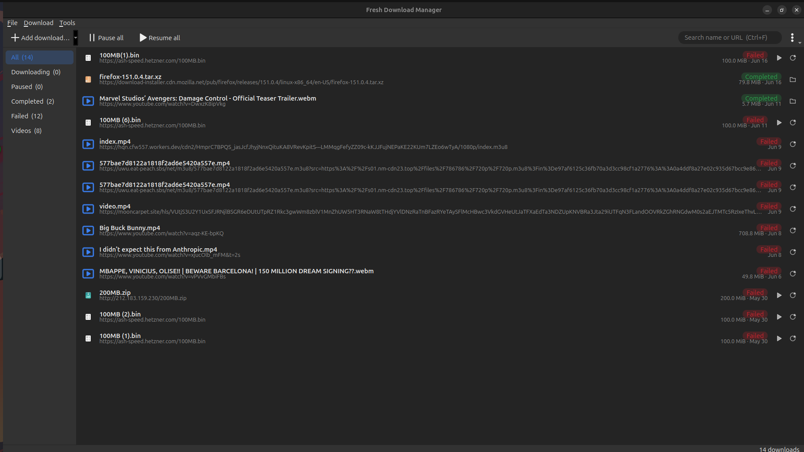
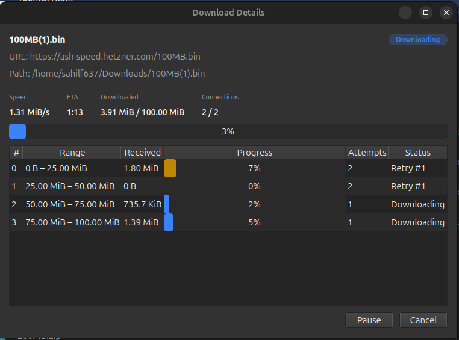

# Fresh Download Manager (FDM)

A fast, multi-connection download manager for Linux. FDM splits each downloads
across several parallel HTTP connections, adapts the connection count to the
server in real time, and resumes cleanly after a pause or restart. It ships as
a **Qt desktop app**, a **command-line tool**, and a **browser extension** that
routes downloads straight from Chrome/Firefox into FDM — carrying along the
cookies/referer so login-protected files keep working.



The **Download Details** window shows every segment of a download live —
including the ones created on the fly when FDM splits a slow chunk to keep all
connections busy (segments 5 and 6 below are tails carved out of segment 2):



## Features

- **Multi-connection segmented downloads** — each file is fetched over several
  HTTP range requests in parallel for higher throughput.
- **Adaptive concurrency** — starts at 4 connections and grows to 8 after a
  sustained quiet period; backs off automatically (AIMD) when the server
  answers `429 Too Many Requests`.
- **Dynamic re-segmentation (work stealing)** — when a connection finishes and
  nothing is queued, FDM splits the largest in-flight segment so fast links
  never sit idle waiting on a slow one.
- **Pause / resume / cancel**, persistent across restarts — progress is stored
  in SQLite and downloads resume from exactly where they stopped via HTTP range
  requests.
- **Automatic retry** with exponential backoff and transient-vs-fatal error
  classification (retries timeouts/resets/5xx/429; fails fast on 403/404/TLS).
- **Connection, DNS, and TLS-session reuse + HTTP/2 multiplexing** so parallel
  chunks avoid repeated handshakes.
- **Integrity metadata** — captures server-advertised digests
  (`Content-Digest` / `Digest` / `Content-MD5`) and the suggested filename
  (`Content-Disposition`, RFC 6266/5987).
- **Browser integration** — capture downloads from Chrome/Firefox, or use the
  right-click _Download with FDM_; cookies/referer/user-agent are forwarded so
  authenticated downloads work.
- **Video & streaming downloads** — pick a quality from the in-page panel or
  right-click a video; FDM extracts with **yt-dlp** and muxes with **ffmpeg**.
  Direct http(s) streams ride the same multi-connection engine, and a plain
  `.m3u8` can be saved with ffmpeg alone when yt-dlp isn't installed. See the
  [optional dependencies](#optional-video-downloads) for Cloudflare-gated
  streams.
- **Per-segment progress UI**, single-instance GUI, and a scriptable CLI.

## Components

| Path         | What it is                                                                                 |
| ------------ | ------------------------------------------------------------------------------------------ |
| `engine/`    | libcurl-based download engine (`fdm_engine`): segmentation, scheduling, retries, resume.   |
| `store/`     | Qt persistence layer (`fdm_store`): SQLite database, download manager, list model.         |
| `gui/`       | Qt 6 Widgets desktop app (`fdm-gui`).                                                      |
| `cli/`       | Command-line tool (`fdm-cli`).                                                             |
| `host/`      | Native-messaging bridge (`fdm-native-host`) between the browser and the GUI.               |
| `extension/` | MV3 browser extension (Chrome + Firefox).                                                  |
| `ipc/`       | Local-socket protocol shared by the GUI and the host.                                      |
| `tests/`     | doctest-based test suite (uses local fixture servers, no internet needed).                 |
| `packaging/` | Debian (`.deb`) packaging, desktop entry, icons, and system-wide native-host registration. |

## Install

### Debian / Ubuntu — `.deb` (recommended)

Download the latest `fresh-download-manager_*.deb` from the
[Releases page](https://github.com/sahilf637/fdm/releases) and install it; `apt`
pulls in Qt, libcurl, and the SQLite driver automatically:

```sh
sudo apt install ./fresh-download-manager_1.0.0_amd64.deb
```

The package installs `fdm-gui`, `fdm-cli`, and the browser bridge, and registers
the native-messaging host **system-wide** — so the
[browser extension](#browser-extension) connects with no per-user setup. Launch
**FDM** from your application grid, or run `fdm-gui`.

> ⚠️ The browser bridge needs an **unconfined** browser. Ubuntu's default _snap_
> Firefox can't reach the host (a sandbox limitation, not a bug) — use Mozilla's
> `.deb` Firefox or a `.deb` Chrome/Chromium.

Building the `.deb` yourself — and baking in the published extension IDs — is
documented in [`packaging/README.md`](packaging/README.md). To run from source
instead, see [Build](#build) below.

## Requirements

- A C++17 compiler (GCC/Clang)
- CMake ≥ 3.20
- libcurl (with HTTP/2 support recommended)
- Qt 6 (Core, Widgets, Sql, Network, Concurrent)

Tested with Qt 6.4.2 and libcurl 8.5.0.

On Debian/Ubuntu:

```sh
sudo apt install build-essential cmake libcurl4-openssl-dev qt6-base-dev
```

### Optional: video downloads

Ordinary file downloads need nothing extra. Video/streaming downloads shell out
to two external tools at runtime; FDM looks for them next to its binaries (e.g.
`build/host/`) or on `PATH`:

- **yt-dlp** — stream extraction (HLS/DASH and sites like YouTube).
- **ffmpeg** — muxes separate audio/video tracks, and can save a plain `.m3u8`
  by itself when yt-dlp is absent (`sudo apt install ffmpeg`).

Some streams sit behind a Cloudflare anti-bot check and return `403`. yt-dlp can
get past it by impersonating a browser's TLS fingerprint, which needs the
optional **`curl_cffi`** backend. FDM only falls back to impersonation after a
normal attempt fails, so it's never required — but for the pure-python yt-dlp
(run by the system `python3`) you can enable it with:

```sh
python3 -m pip install --user --break-system-packages curl_cffi
# verify: yt-dlp --list-impersonate-targets   (targets should not say "unavailable")
```

## Build

```sh
cmake -S . -B build -DCMAKE_BUILD_TYPE=Release
cmake --build build -j
```

This produces:

- `build/gui/fdm-gui` — the desktop app (plus a `fdm-gui.sh` launcher wrapper)
- `build/cli/fdm-cli` — the command-line tool
- `build/host/fdm-native-host` — the browser bridge
- `build/tests/fdm_tests` — the test binary

## Run

### Desktop app

```sh
./build/gui/fdm-gui
```

If you launch it from a snap-confined shell (e.g. the integrated terminal of a
snap-installed VS Code), use the wrapper instead — it strips leaked library
paths that would otherwise break dynamic linking:

```sh
./build/gui/fdm-gui.sh
```

To get a proper application icon in the dock / launcher:

```sh
./gui/install-desktop.sh
```

### Command line

```sh
fdm-cli <url> <output-path>     # download a URL to a file (or a directory)
fdm-cli --probe <url>           # print size + range-support for a URL
fdm-cli                         # print the libcurl version
```

## Browser extension

The extension cancels the browser's own download and opens FDM's **New
Download** dialog pre-filled with the URL, filename, and auth context.

```
Browser ──(native messaging, stdio)──▶ fdm-native-host ──(local socket)──▶ fdm-gui
```

> **Installed the `.deb`?** The native-messaging host is already registered
> system-wide — skip step 3 below; just load (or, once published, install) the
> extension. The steps below otherwise assume a **source build**.

Quick setup:

1. **Build** the app and host (above) — you need `build/host/fdm-native-host`.
2. **Load the extension:**
   - **Chrome / Chromium:** `chrome://extensions` → enable _Developer mode_ →
     _Load unpacked_ → select the `extension/` folder. Copy the extension ID.
   - **Firefox:** run `extension/pack-firefox.sh`, then `about:debugging` →
     _This Firefox_ → _Load Temporary Add-on_ → pick
     `extension/dist-firefox/manifest.json`.
3. **Register the native host:**
   ```sh
   ./extension/install-host.sh --chrome-id <ID from chrome://extensions>
   ```
4. **Verify:** open the extension popup → _Test connection_ → should say
   _Connected to FDM_.

> **⚠️ Snap Firefox (the Ubuntu default) is not supported.** Its sandbox refuses
> to launch an external native-messaging host. Use the **non-snap Firefox**
> (Mozilla's `.deb` from <https://packages.mozilla.org/apt>) or a `.deb`
> Chrome/Chromium, which run unconfined and work normally.

See [extension/README.md](extension/README.md) for the full details.

## Tests

```sh
ctest --test-dir build --output-on-failure
# or run the binary directly:
./build/tests/fdm_tests
```

The suite spins up local fixture servers (under `tests/`), so it runs fully
offline.

## License

FDM is free software, released under the
[GNU General Public License v3.0 or later](LICENSE) (GPL-3.0-or-later).
